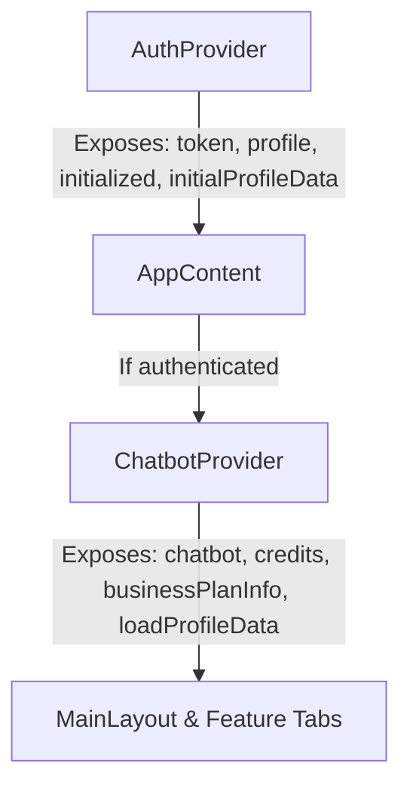

# Chatbot Admin Application Documentation

ဤစာရွက်စာတမ်းသည် **Chatbot Admin App** ၏ တည်ဆောက်ပုံစနစ် (Architecture)၊ State Management လုပ်ဆောင်ပုံ Workflow နှင့် ချိတ်ဆက်ထားသော API စာရင်းများကို စနစ်တကျ မှတ်တမ်းတင်ထားခြင်း ဖြစ်ပါသည်။

---

## ၁။ Application Structure (တည်ဆောက်ပုံ Flow)

Application အား React Contexts နှင့် Modular Components များဖြင့် သပ်ရပ်စွာ ပိုင်းခြားတည်ဆောက်ထားပါသည်။

### Directory Layout
```bash
chatbot-admin-app/
├── src/
│   ├── api/
│   │   └── client.ts            # Axios configuration & API request functions
│   ├── components/
│   │   ├── auth/                # Login, Registration & Onboarding components
│   │   ├── layout/              # Main Shell, Bottom Nav & Navigation drawer
│   │   └── features/            # Feature-specific tabs (Chats, Knowledge, Prompt, Billing)
│   ├── contexts/
│   │   ├── AuthContext.tsx      # Authentication & Boot Initialization state
│   │   └── ChatbotContext.tsx   # Chatbot details & Business usage state
│   ├── types/
│   │   └── index.ts             # TypeScript Type/Interface definitions
│   ├── App.tsx                  # Core app router & loader gate
│   ├── index.css                # Custom Mobile-first iOS Native-like styling (No Tailwind)
│   └── main.tsx                 # App mount entry point
```

### Bootstrap & Mount Flow (စတင်ပွင့်လာပုံအဆင့်ဆင့်)
1. **`main.tsx`** မှစတင်၍ `App.tsx` ကို Render လုပ်သည်။
2. **`App` Component** က `AuthProvider` ဖြင့် တစ်အိမ်လုံးကို လွှမ်းခြုံပေးသည်။
3. **`AppContent`** က `useAuth()` မှတစ်ဆင့် `initialized` ဖြစ်မဖြစ် စစ်ဆေးသည်-
   - `initialized === false` ဖြစ်ပါက fullscreen spinner အဝိုင်းလည်နေမည်။
   - `initialized === true` ဖြစ်ပါက Authentication Token ကို စစ်ဆေးသည်။
4. **Token စစ်ဆေးမှု (Auth Gate)**:
   - **Token မရှိလျှင်:** `<LoginScreen />` ကို ပြသပေးသည်။
   - **Token ရှိလျှင်:** `<ChatbotProvider>` နှင့် `<MainLayout />` ကို Render လုပ်ပြီး Dashboard သို့ ဝင်ရောက်သည်။

---

## ၂။ State Management Workflow (စတိတ်စီမံခန့်ခွဲမှု)

Global State Management ကို Prop-drilling (ဆင့်ကဲပေးပို့ခြင်း) မရှိစေရန် Context Provider နှစ်ခုဖြင့် စီမံခန့်ခွဲပါသည်-



### (က) AuthContext (`src/contexts/AuthContext.tsx`)
အသုံးပြုသူ၏ အကောင့်ဝင်ရောက်မှုနှင့် profile initializing အပိုင်းကို စီမံခန့်ခွဲသည်။
- **States:**
  - `token` (string | null): localStorage (`chatbot_admin_token`) မှ ဖတ်ယူသည်။
  - `profile` (AdminProfile | null): အကောင့်ပိုင်ရှင်၏ metadata (အမည်၊ အီးမေးလ်၊ ခွင့်ပြုချက်များ)။
  - `initialized` (boolean): App စတင်ပွင့်ချိန်တွင် Profile အချက်အလက်များ အောင်မြင်စွာ fetch လုပ်ပြီးစီးမှု အခြေအနေ (Flickering ပြဿနာကို ဖြေရှင်းရန် သုံးသည်)။
  - `initialProfileData` (any): Boot တက်ချိန်တွင် ရရှိလာသော profile data တစ်ခုလုံးကို သိမ်းဆည်းပြီး `ChatbotContext` သို့ လမ်းကြောင်းပေးသည်။
- **Actions:**
  - `login(newToken)`: Token အား သိမ်းဆည်းပြီး initialization spinner ပြန်ဖွင့်ပေးသည်။
  - `logout()`: Token များနှင့် cached profile များကို ရှင်းလင်းပေးသည်။
  - `fetchProfile()`: `/chatbot-admin/profile` သို့ လှမ်းခေါ်ပြီး admin profile data ကို update လုပ်သည်။

### (ခ) ChatbotContext (`src/contexts/ChatbotContext.tsx`)
ချိတ်ဆက်ထားသော Bot ၏ အချက်အလက်များနှင့် လုပ်ငန်းအသုံးပြုမှု (credits/billing) အပိုင်းကို စီမံခန့်ခွဲသည်။
- **States:**
  - `chatbot` (ChatbotDetails | null): ချိတ်ဆက်ထားသော Telegram/Facebook bot configuration။
  - `credits` (number): အသုံးပြုရန် ကျန်ရှိနေသော Message Credits ပမာဏ။
  - `businessPlanInfo` (any): လက်ရှိအသုံးပြုနေသော Business Package နှင့် သက်တမ်းကုန်ဆုံးမည့် ရက်စွဲ။
  - `showInAppTour` (boolean): ပထမဆုံး bot ဆောက်ပြီးချိန်တွင် အသုံးပြုပုံ guide (Tour) ပြသရန် အခြေအနေ။
- **Actions:**
  - `loadProfileData()`: API မှတစ်ဆင့် chatbot data များကို refresh လုပ်ပြီး state များကို update ပြုလုပ်သည်။

---

## ၃။ API Endpoints Integration (ချိတ်ဆက်ထားသော API များ)

Frontend အက်ပ်မှ Backend `/api/v1` သို့ လှမ်းခေါ်သော API Request လုပ်ဆောင်ချက်များကို **`src/api/client.ts`** တွင် စုစည်းထားပါသည်-

### ၁။ Authentication (အကောင့်ဝင်ခြင်းနှင့် ဆောက်ခြင်း)
* **Login (`POST /chatbot-admin/login`)**
  * Email နှင့် Password ပေးပို့ပြီး JWT Token ကို ရယူသည်။
* **Register (`POST /chatbot-admin/register`)**
  * Standalone chatbot admin အကောင့်သစ် ဖွင့်လှစ်သည်။

### ၂။ Profile & Plan Metadata (ကိုယ်ရေးအချက်အလက်နှင့် ပက်ကေ့ဂျ်)
* **Get Profile (`GET /chatbot-admin/profile`)**
  * Admin ၏ ခွင့်ပြုချက်များ၊ bot အချက်အလက်များနှင့် ကျန်ရှိသော message credits များကို တစ်ပါတည်း ရယူသည်။
* **Get Available Plans (`GET /plans`)**
  * ဝယ်ယူနိုင်သော Package နှုန်းထားများ (Lite, Basic, Pro) ကို ဆွဲထုတ်ပြသသည်။

### ၃။ Billing & Upgrades (ငွေပေးချေမှု)
* **Get Payment Methods (`GET /subscription/payment-methods`)**
  * Plan အလိုက် ငွေလွှဲရမည့် KPay နံပါတ်နှင့် Reseller ID တို့ကို စနစ်တကျ စစ်ဆေးရယူသည်။
* **Submit Upgrade (`POST /subscription/upgrade`)**
  * ဝယ်ယူလိုသော Plan အမည်၊ Reseller ID နှင့် ငွေလွှဲပြေစာ Screenshot (base64) တို့ကို တင်သွင်းသည်။

### ၄။ Chatbot Management (ဘော့တ်စီမံခြင်း)
* **Create Chatbot (`POST /chatbot-admin/chatbot`)**
  * Telegram Bot Token ကို အသုံးပြုပြီး bot အသစ် ချိတ်ဆက်သည်။
* **Update Chatbot Info (`PUT /chatbot-admin/chatbot`)**
  * Bot ၏ အမည်နှင့် description အား တည်းဖြတ်သည်။
* **System Prompt (`GET` & `PUT /chatbot-admin/system-prompt`)**
  * AI bot ၏ စရိုက်လက္ခဏာနှင့် ညွှန်ကြားချက်များ (System Prompt) ကို ရယူ/ပြင်ဆင်သည်။

### ၅။ Knowledge Base (RAG Data Ingestion)
* **Get Knowledge Chunks (`GET /chatbot-admin/knowledge`)**
  * Bot ထဲသို့ ထည့်သွင်းထားသော RAG data chunks များကို စာရင်းလိုက် ဆွဲထုတ်သည်။
* **Ingest Document (`POST /chatbot-admin/knowledge/ingest`)**
  * File/Text စာအုပ်များမှ အချက်အလက်များကို AI မှ နားလည်နိုင်ရန် Embeddings အဖြစ်ပြောင်းလဲထည့်သွင်းသည်။
* **Update/Delete Chunk (`PUT` & `DELETE /chatbot-admin/knowledge/chunks/:id`)**
  * ထည့်သွင်းပြီးသား အချက်အလက်များအား ပြင်ဆင်/ဖျက်သိမ်းသည်။

### ၆။ Conversations (Real-time Live Chat)
* **Get Conversations (`GET /chatbot-admin/conversations`)**
  * Customer များနှင့် စကားပြောထားသော active chat list ကို ရယူသည်။
* **Get Messages (`GET /chatbot-admin/conversations/:senderId`)**
  * Customer တစ်ဦးချင်းစီနှင့် ပြောဆိုထားသည့် စကားပြောမှတ်တမ်းကို ဆွဲထုတ်သည်။
* **Reply to Conversation (`POST /chatbot-admin/conversations/:senderId/reply`)**
  * Admin ဘက်မှ Customer ဆီသို့ စာတိုက်ရိုက် ပြန်လည်ဖြေကြားသည်။
